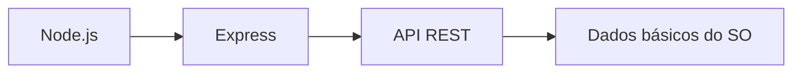
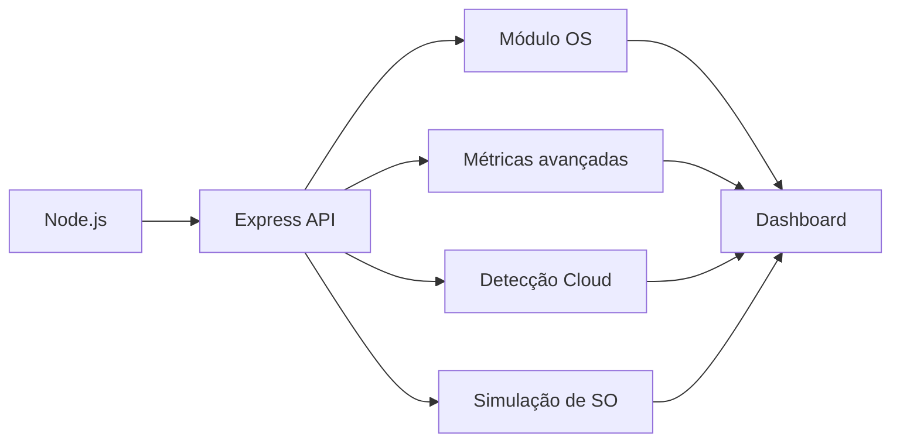
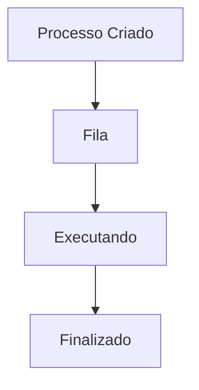

# 🚀 RELATÓRIO COMPARATIVO — EVOLUÇÃO DO PROJETO CLOUD-SO-APP

---

---

# 📌 1. VISÃO GERAL
Este relatório compara:

| Versão | Descrição |
|------|--------|
| 🟢 Projeto Anterior (Aula 07) | API simples de monitoramento |
| 🔵 Projeto Atual (Aula 08) | Dashboard avançado + simulação de SO |

---

# ⚙️ 2. ARQUITETURA — ANTES vs DEPOIS

## 🟢 Projeto Anterior

---

## 🔵 Projeto Atual

---

# 🧠 3. EVOLUÇÃO CONCEITUAL

## 🟢 Antes (Aula 07)

- API REST básica
- Dados simples:
- hostname
- CPU
- memória
- uptime
- Deploy funcional

📌 Objetivo:
> Entender cloud + backend

---

## 🔵 Agora (Aula 08)

- Dashboard completo
- Métricas interpretáveis
- Análise do sistema
- Simulação de SO
- Comparação entre ambientes

📌 Objetivo:
> Analisar como Sistemas Operacionais se relacionam com desenvolvimento backend.

---

# 📊 4. COMPARAÇÃO TÉCNICA

| Aspecto | 🟢 Antes | 🔵 Agora |
|--------|--------|--------|
| API | Básica | Estruturada |
| Dados | Brutos | Interpretados |
| Arquitetura | Linear | Modular |
| Cloud | Deploy simples | Análise de ambiente |
| Sistema Operacional | Observação | Observação + simulação |
| Complexidade | Baixa | Média/Alta |
| Nível | Iniciante | Intermediário/Profissional |

---

# 🔍 5. EVOLUÇÃO DAS MÉTRICAS

## 🟢 Antes

- CPU (quantidade)
- Memória total
- Memória livre
- Uptime bruto

---

## 🔵 Agora

- Uso percentual de memória
- Uso médio de CPU
- Uptime formatado
- IP da máquina
- Quantidade de arquivos
- Status do sistema

📌 Virada conceitual:

> Dados → Informação

---

# ⚡ 6. SALTO DE DESENVOLVIMENTO

## 🟢 Antes

👉 API = "sensor"

## 🔵 Agora

👉 API = "sistema inteligente"

---

# 🧠 7. INTEGRAÇÃO COM SISTEMA OPERACIONAL

Uso do módulo `os`:

- arquitetura
- CPUs
- memória
- uptime
- kernel

📌 Resultado:

> Monitoramento real de sistema

---

# ☁️ 8. CLOUD — EVOLUÇÃO

## 🟢 Antes

- Deploy no Render
- Aplicação online

---

## 🔵 Agora

- Detecção de ambiente:
- local vs cloud
- Variáveis de ambiente
- Porta dinâmica
- Infraestrutura virtual

📌 Conceito-chave:

> Infraestrutura como serviço (IaaS)

---

# 🧪 9. SIMULAÇÃO DE SISTEMAS OPERACIONAIS

## 🟢 Antes

  Apenas leitura do sistema

---

## 🔵 Agora

 Simulação de:
- processos
- memória
- filas de execução

---

# 🎯 CONCLUSÃO

O desenvolvimento deste projeto na disciplina de Sistemas Operacionais permitiu aplicar, de forma prática, conceitos relacionados a backend, computação em nuvem e monitoramento de recursos computacionais.

A utilização de Node.js, Express e Render possibilitou compreender como aplicações modernas interagem com o sistema operacional e podem ser disponibilizadas em ambientes cloud, aproximando a atividade acadêmica de cenários reais da área de tecnologia.

Além da evolução técnica do projeto, a atividade contribuiu para o desenvolvimento de competências importantes no curso de Análise e Desenvolvimento de Sistemas da Fatec Itapetininga, como modelagem de aplicações, criação de APIs REST, deploy em nuvem, versionamento e análise de infraestrutura computacional. :contentReference[oaicite:0]{index=0}

Por fim, o projeto demonstrou a importância da integração entre teoria e prática no processo de formação tecnológica, permitindo compreender de maneira aplicada como sistemas operacionais, backend e computação em nuvem trabalham juntos na construção de soluções modernas.

---

---

